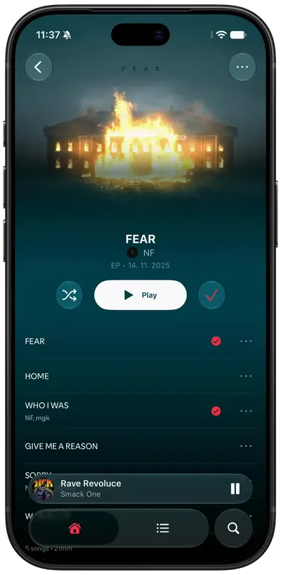
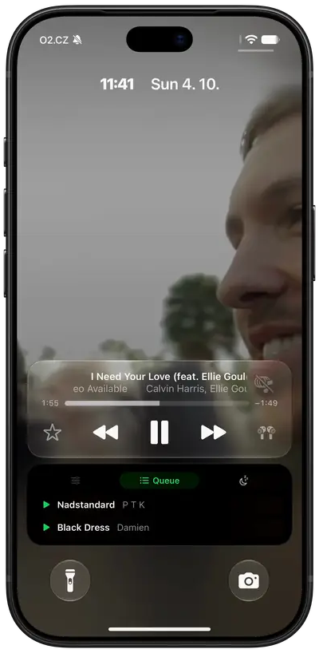

  

<h1 align="center">spoti.pw</h1>

Spotify, in glass.

  
  
  
  
  

  <a href="https://spoti.pw">spoti.pw</a> ·
  <a href="#build-it">Build it</a> ·
  <a href="docs/tweaks.md">Hack on it</a> ·
  <a href="https://ko-fi.com/darkksh">Support</a>

  
  
  
  
  
  

A no-jailbreak Theos tweak that rebuilds Spotify for iOS in Liquid Glass, injected into your own
decrypted IPA and signed with your own certificate.

Built and tested on **Spotify 9.1.78** — use that version's IPA. The mod hooks Spotify's own classes,
which change between releases, so another version may build and then break.

| | |
|---|---|
| The redesign | **iOS 26+** (untested below) |
| Legacy look | iOS 16.1+ |
| Live Activity | iOS 17+ |

The redesign is `UIGlassEffect`, which only exists from iOS 26. Below that the Redesigned UI switch
still works, but it warns first: the redesign falls back to a blur there and has not been tested at
all. Both looks live in Settings → Mod Settings.

## Build it

No IPA is distributed. Bring a decrypted **Spotify 9.1.78** IPA; you get an unsigned
`spoti.pw-<mod version>.ipa` to sign with SideStore, Feather or any certificate signer. Each
[release](https://github.com/skopevoj/spoti.pw/releases) also carries the tweak's `.deb`.

### Build with GitHub Actions

Fork the repo, enable Actions, run **Build IPA from your own Spotify IPA**. It takes a direct link to
your decrypted `.ipa` and hands the built IPA back as a workflow artifact. No Mac needed; the link is
masked in the log and the result stays in your fork.

### Build on a Mac

Theos in `~/theos` and Xcode with an iPhoneOS 26+ SDK (`xcode-select` it). An SDK in `~/theos/sdks`
alone builds too, but without the Live Activity. Then:

    brew install make ldid dpkg zsign ideviceinstaller libimobiledevice
    uv tool install "cyan @ git+https://github.com/asdfzxcvbn/pyzule-rw"

Put the decrypted `.ipa` in `ipa/`, then:

    make release    # out/spoti.pw-<version>.ipa, ready to sign
    make install    # the same, signed with your certificate and pushed over USB

`make install` reads `SIGN_P12`, `SIGN_PROFILE` and `SIGN_P12_PASSWORD` from `.signing.env`; copy
`.signing.env.example` and fill it in.

The first build spends a minute reading Spotify's flags out of your IPA. `make flags` regenerates it.

### Signing

Sign with a bundle id matching your certificate's App ID. If it doesn't match, the app still works
but tapping the player on the lock screen won't open it — and it tells you on first launch which id
to use. In Feather, copy the App ID into **Identifier** and leave **PPQ protection** off; AltStore,
SideStore and Sideloadly get this right on their own.

The app keeps Spotify's bundle id, so it installs over the real Spotify.

## Support

If it made your phone nicer to use, a coffee is a good way to say so.

## Contributing

Pull requests are welcome. The pull request's description has a box for agreeing to the
[Contributor License Agreement](CLA.md), which gives the project's owner the rights to the
contribution; it is ticked once, before the first pull request is merged.

## Star history

<a href="https://star-history.com/#skopevoj/spoti.pw&Date">
  <picture>
    <source media="(prefers-color-scheme: dark)" srcset="https://api.star-history.com/svg?repos=skopevoj/spoti.pw&type=Date&theme=dark">
    
  </picture>
</a>

## Credits

[cyan](https://github.com/asdfzxcvbn/pyzule-rw) injects, [Theos](https://theos.dev) builds, and
[FLEX](https://github.com/FLEXTool/FLEX), as hopeless's AutoFLEX build in `vendor/`, is the inspector
the view trees are read through.

## License

Source available under the [PolyForm Strict License 1.0.0](LICENSE): you can read the code and use
the mod yourself, but not change it, reuse it in other projects or redistribute it. Releases up to
v0.21.1 were published under GPL-3.0 and stay under it. Files in `vendor/` and `.agents/` keep their
own licences.

Not affiliated with Spotify.
