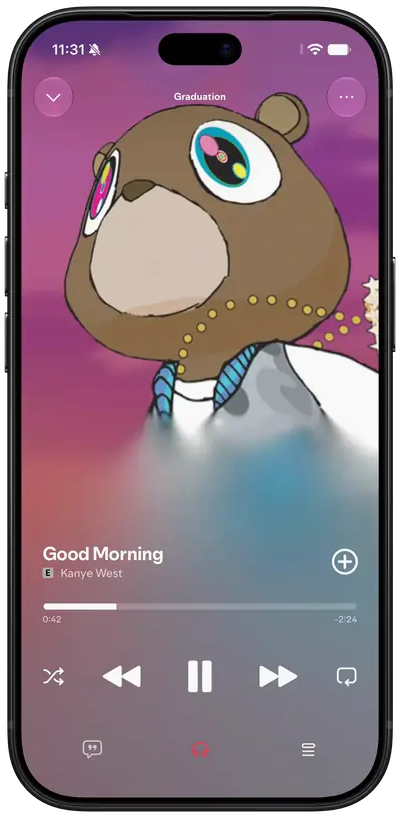
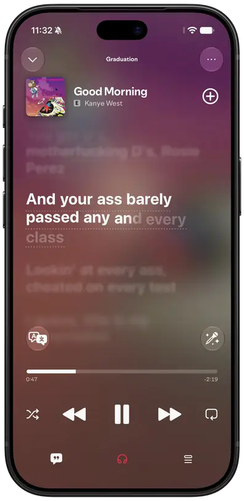
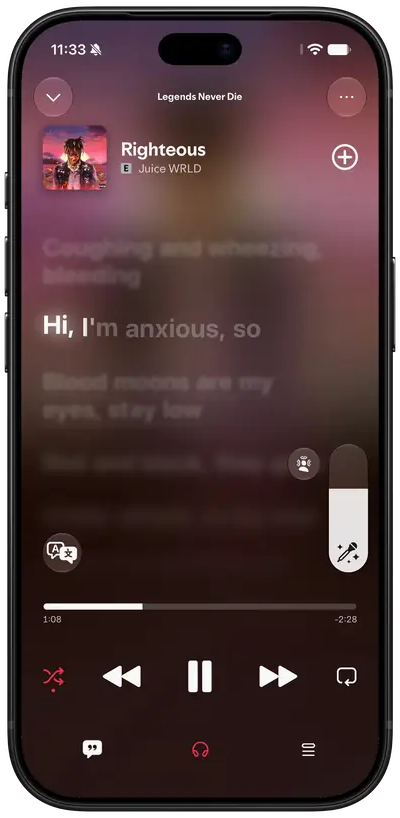
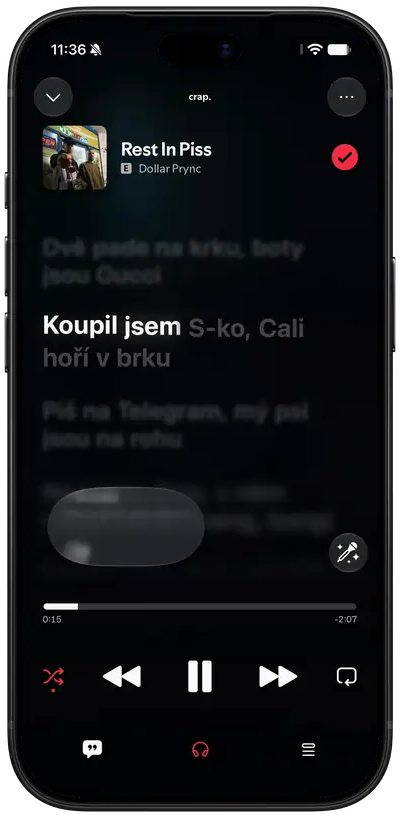
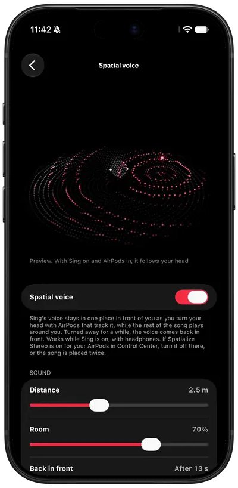
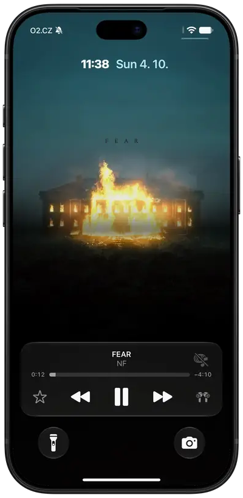
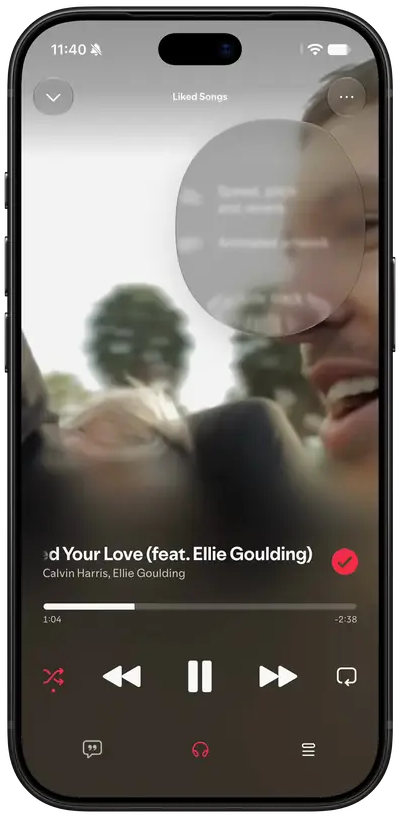
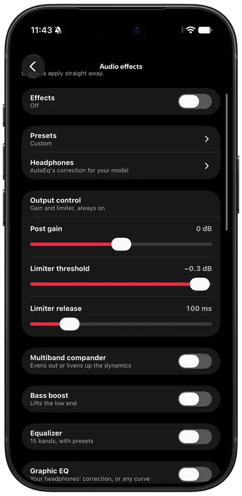
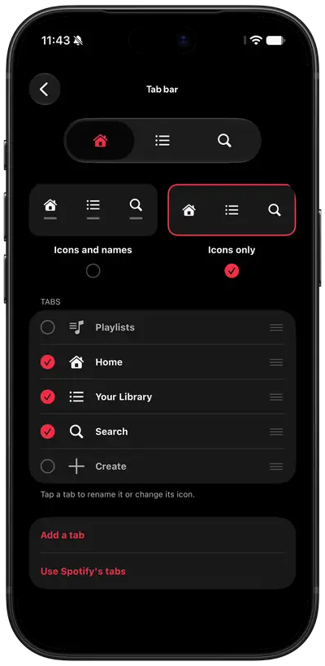

  

<h1 align="center">Chroma</h1>

Spotify, in glass.

  
  
  
  

  <a href="https://chroma.pw">chroma.pw</a> ·
  <a href="#install">Install</a> ·
  <a href="#free-and-plus">Plus</a> ·
  <a href="https://discord.gg/9e4GR8TKMj">Discord</a>

  
  
  
  

A no-jailbreak tweak that redesigns Spotify for iOS in Liquid Glass: word-by-word lyrics, Sing,
animated covers, a Live Activity, audio effects and 140 switches in Mod Settings, with Spotify's own
telemetry blocked. It goes into your own decrypted IPA, which you sign with your own certificate.

Built and tested on **Spotify 9.1.78** — use that version's IPA. The mod hooks Spotify's own classes,
which change between releases, so another version may patch fine and then break.

| | |
|---|---|
| The redesign | **iOS 26+** (untested below) |
| Legacy look | iOS 16.1+ |
| Live Activity | iOS 17+ |
| Sing | iOS 18+ |
| Animated lock screen | iOS 26+ |

The redesign is `UIGlassEffect`, which only exists from iOS 26. Below that the Redesigned UI switch
still works, but it warns first: the redesign falls back to a blur there and has not been tested at
all. Both looks live in Settings → Mod Settings.

## What's in it

### Lyrics, word by word

Each word lights up as it's sung, and the lines around it blur. Tap a line to jump there.

- Translations under each line, or any language translated on a tap
- Genius annotations for the line you tap
- Arabic and Hebrew the right way round
- A landscape screen of their own when the phone turns

  

### Sing

Turn the vocals down and sing over the song, with the lyrics still in time.

- Vocals anywhere from silent to full, or nothing but the vocals
- With AirPods, the voice stays in front of you as you turn your head

  

### Covers that move

An album with an animated cover plays it in the player, on its page and on the lock screen.

- Animated covers in the player and on album pages
- Animated covers on the lock screen
- The lyrics as the lock screen's artwork

  

### Lock screen and Dynamic Island

A Live Activity with the controls, the queue or a sleep timer, in the Dynamic Island too.

- Controls, queue or timer, your pick
- Like and dislike without unlocking
- On Apple Watch, CarPlay and StandBy as well

  

### Speed, pitch and sound

Slow a song down and it stays in key, or change the key and keep the tempo. Audio effects run on
Spotify's own audio.

- Reverb, from a small room to a hall
- EQ, bass boost, compander, convolver and more
- AutoEq correction for your headphones

  
  

### Make it yours

Pick the tabs, their icons and the pages they open, and one font for the whole app.

- A tab for any page, with SF Symbols icons
- Any font, app-wide
- An accent colour and true black

  

## Free and Plus

Chroma is free to install. Plus, a monthly membership on [Patreon](https://www.patreon.com/chromapw),
adds the extras. Get it from Mod Settings or at [chroma.pw/plus](https://chroma.pw/plus).

**Free**

- The redesign: Home, Search, Library, playlists, albums, artists, the player and the tab bar
- Word-by-word lyrics from Musixmatch, LRCLIB, NetEase, BiniLyrics, Unison and Spicy Lyrics, with
  Musixmatch's translations
- Fluid artwork behind the player
- Your own tabs and icons, an accent colour, app icons and fonts
- The legacy look, with AMOLED black
- Telemetry blocked, clutter removed, and Labs with Spotify's hidden features

**Plus**

- Sing, spatial voice, audio effects with presets and AutoEq
- Speed, pitch and reverb
- Apple Music's animated artwork in the player, on album pages and on the lock screen
- Lyrics on the lock screen and in the Live Activity
- Genius line meanings, Gemini translation, landscape lyrics and the lyrics look editor
- The Apple Music style mini player
- Vibrations, Music Haptics and AirPods gestures
- Listening stats, and lyrics and editing for local files

## Install

No IPA is distributed. Bring a decrypted **Spotify 9.1.78** IPA; you get an unsigned
`spoti.pw-<mod version>.ipa` to sign with SideStore, Feather or any certificate signer. No Mac needed.

### In the browser

Open [chroma.pw/patch](https://chroma.pw/patch), choose the IPA and download the patched one. The IPA
is patched on your device and never uploaded.

### With GitHub Actions

Fork the repo, enable Actions, run **Build IPA from your own Spotify IPA**. It takes a direct link to
your decrypted `.ipa`, patches it with the newest release and hands the IPA back as a workflow artifact.
The link is masked in the log and the result stays in your fork. A fork made before 0.50 needs
**Sync fork** first.

Each [release](https://github.com/skopevoj/spoti.pw/releases) also carries the tweak's `.deb`.

### Signing

Sign with a bundle id matching your certificate's App ID. If it doesn't match, the app still works
but tapping the player on the lock screen won't open it — and it tells you on first launch which id
to use. In Feather, copy the App ID into **Identifier** and leave **PPQ protection** off; AltStore,
SideStore and Sideloadly get this right on their own.

The app keeps Spotify's bundle id, so it installs over the real Spotify.

## Community

The [Discord server](https://discord.gg/9e4GR8TKMj) has help, previews of upcoming features and a
message when a release is out. Bugs can also go to [issues](https://github.com/skopevoj/spoti.pw/issues).

## Support

Chroma is made by one student. Plus keeps it going, and so does a coffee.

## Contributing

Pull requests are welcome. The pull request's description has a box for agreeing to the
[Contributor License Agreement](CLA.md), which gives the project's owner the rights to the
contribution; it is ticked once, before the first pull request is merged.

## Star history

<a href="https://star-history.com/#skopevoj/spoti.pw&Date">
  <picture>
    <source media="(prefers-color-scheme: dark)" srcset="https://api.star-history.com/svg?repos=skopevoj/spoti.pw&type=Date&theme=dark">
    
  </picture>
</a>

## Credits

[cyan](https://github.com/asdfzxcvbn/pyzule-rw) injects, [Theos](https://theos.dev) builds, and
[FLEX](https://github.com/FLEXTool/FLEX), as hopeless's AutoFLEX build in `vendor/`, is the inspector
the view trees are read through. The headphone corrections come from
[AutoEq](https://github.com/jaakkopasanen/AutoEq).

## License

Since 0.50 Chroma is developed in a private repository; the source here is that of 0.22.0 and the
0.23.0 beta. It is available under the [PolyForm Strict License 1.0.0](LICENSE): you can read the
code and use the mod yourself, but not change it, reuse it in other projects or redistribute it.
Releases up to v0.21.1 were published under GPL-3.0 and stay under it. Files in `vendor/` and
`.agents/` keep their own licences.

Not affiliated with Spotify.
